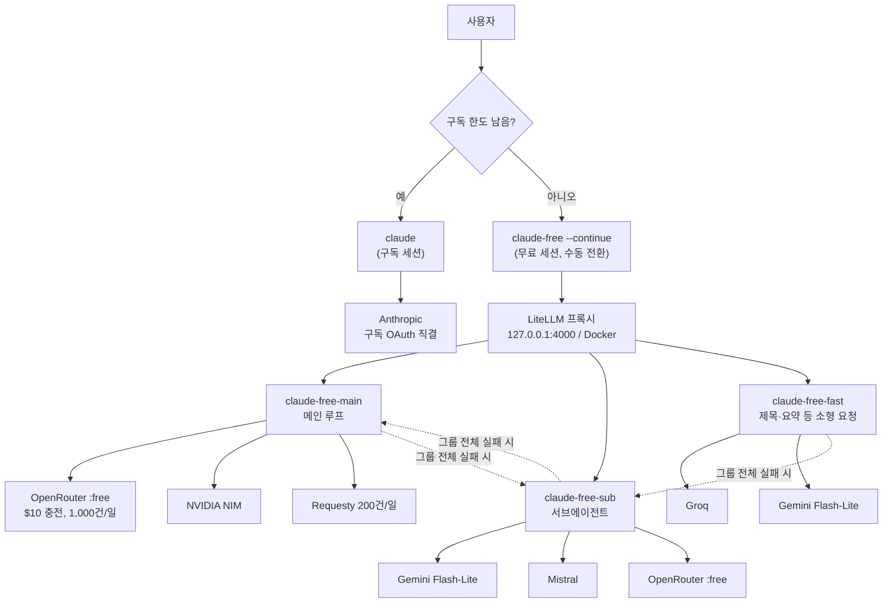
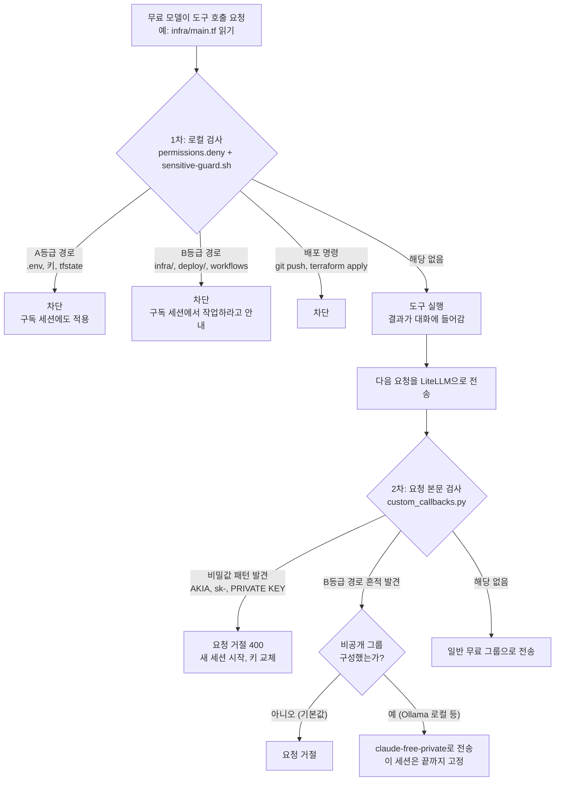
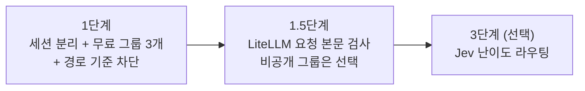

# 최종 설계안 도표

작성일: 2026-09-21
상세 내용: `DESIGN.md`(전체 설계), `SENSITIVE.md`(민감 정보 보호)
보는 방법: VS Code에서 이 파일을 열고 `Cmd+Shift+V`(미리보기). Mermaid가 그림으로 안 나오면 확장 "Markdown Preview Mermaid Support"를 설치한다. GitHub에서는 그대로 그림으로 나온다.

---

## 1. 전체 구조

- 평소에는 `claude`로 구독에 직결한다. 한도가 소진되면 `claude-free --continue`로 같은 대화를 이어간다. 전환은 수동이다.
- 같은 그룹 안에서 제공처가 429를 반환하면, LiteLLM이 그 제공처를 5분간 빼고 같은 그룹의 다른 제공처로 재시도한다.
- 점선은 그룹 전체가 실패했을 때 넘어가는 다른 그룹이다.
- 서브에이전트는 `CLAUDE_CODE_SUBAGENT_MODEL=claude-free-sub`로 연결한다.

| 그룹 | 용도 | 제공처 |
|---|---|---|
| `claude-free-main` | 메인 루프 | OpenRouter `:free`, NVIDIA NIM, Requesty |
| `claude-free-sub` | 서브에이전트 | Gemini Flash-Lite, Mistral, OpenRouter `:free` |
| `claude-free-fast` | 제목 생성·요약 등 소형 요청 | Groq, Gemini Flash-Lite |

---

## 2. 무료 세션의 민감 정보 판별

판별은 모두 코드(정규식 비교)로 한다. 모델을 호출하지 않는다.

- 1차는 Claude Code CLI 프로그램의 로컬 기능이다. 내 컴퓨터에서만 실행되고 Claude 토큰이 없어도 동작한다.
- 2차는 1차를 거치지 않고 들어온 내용(`cat` 출력, MCP 응답, 이어받은 이전 대화)을 잡는다.

| 등급 | 규칙 | 대상 |
|---|---|---|
| A | 어떤 모델에도 보내지 않는다 (구독 세션 포함) | `.env*`, 키·인증서, `*.tfstate`, `*.tfvars`, `~/.ssh`, `~/.aws`, `~/.kube`, `secrets/`, 운영 DB 덤프 |
| B | 학습·로깅하는 무료 제공처에 보내지 않는다 | `infra/`, `deploy/`, `terraform/`, `k8s/`, `helm/`, `.github/workflows/`, `docker-compose*`, 인증·결제 코드, 실제 고객 데이터, 외주·NDA 저장소 전체 |
| C | 제한 없음 | 나머지 일반 코드 |

---

## 3. 단계 계획

| 단계 | 진행 조건 | 상태 |
|---|---|---|
| 1 | OpenRouter 직결로 무료 모델의 도구 호출 호환성 확인 후 LiteLLM 구성 | 완료 (2026-09-22) |
| 1.5 | custom callback이 `/v1/messages` 경로에서 동작하는지 확인 | 미착수 |
| 3 | Jev 무료 할당량이나 비용, 한국어 정확도 확인 | 보류 |

자동 전환(구독 한도 초과 시 프록시가 무료 모델로 넘기는 구성)은 하지 않는다. 전환은 `claude-free --continue` 명령으로 한다.
