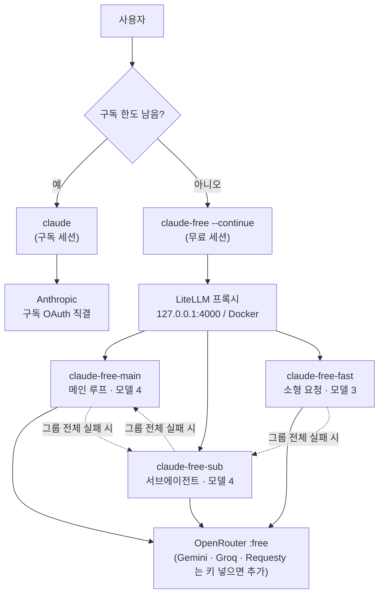
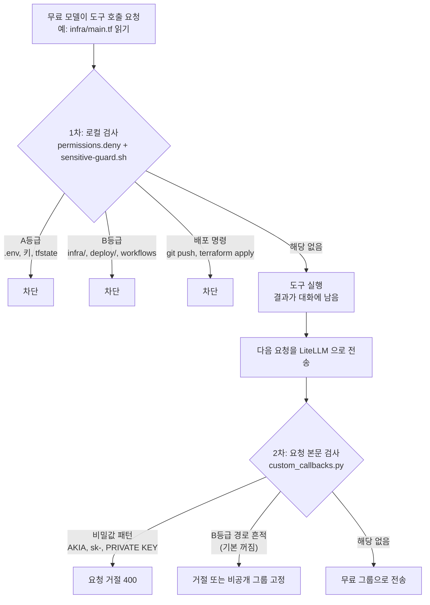

# free-model-settings

Claude Code 구독 한도가 끝났을 때 무료 모델로 작업을 이어가는 설정 모음.
명령 하나로 세션을 바꾸고, 민감한 파일은 무료 제공처로 나가지 않게 막는다.

```
claude          # 평소: 구독으로 Anthropic 직결
claude-free     # 한도 소진 후: 무료 모델로 같은 대화를 이어감
```

- 무료 모델 8개를 세 그룹으로 묶어 돌려 쓴다. 하나가 죽어도 작업이 끊기지 않는다.
- `.env`, `infra/`, `deploy/` 같은 경로는 읽기 전에 막는다.
- 무료 세션에서는 `git push`, `terraform apply` 같은 배포 명령을 막는다.

---

## 구조



그룹 안에서는 `rpm`을 가중치로 무작위 분산한다. 한 모델이 429나 503을 주면 60초간 빼고 같은 그룹의 다른 모델로 재시도한다. 그룹 전체가 막히면 다른 그룹으로 넘어간다. Claude Code는 이 과정을 모르고 응답만 받는다.

| 그룹 | 연결되는 곳 | 기준 |
|---|---|---|
| `claude-free-main` | 메인 모델, `opus`/`sonnet`/`fable` alias | 컨텍스트 큰 모델 |
| `claude-free-sub` | `CLAUDE_CODE_SUBAGENT_MODEL` | 서브에이전트 |
| `claude-free-fast` | `haiku` alias | 제목 생성·요약 등 소형 요청 |

---

## 민감 정보 보호

판별은 모두 코드(정규식)로 한다. 모델을 호출하지 않는다.



2차가 필요한 이유: 1차는 도구 호출의 경로만 본다. `cat` 출력, MCP 응답, 이어받은 이전 대화는 1차를 지나간다.

B등급 경로 검사는 기본으로 꺼져 있다. 경로 "언급"만으로 막기 때문에, `infra/` 폴더가 있는 프로젝트는 Claude Code가 시스템 프롬프트에 넣는 파일 목록 탓에 모든 요청이 막힌다. 켜려면 `docker-compose.yml`의 `GUARD_BLOCK_B_PATHS`를 `1`로 둔다.

| 등급 | 규칙 | 대상 |
|---|---|---|
| A | 어떤 모델에도 보내지 않음 | `.env*`, 키·인증서, `*.tfstate`, `*.tfvars`, `~/.ssh`, `~/.aws`, `~/.kube`, `secrets/` |
| B | 학습·로깅하는 무료 제공처에 보내지 않음 | `infra/`, `deploy/`, `terraform/`, `k8s/`, `helm/`, `.github/workflows/`, `docker-compose*` |
| C | 제한 없음 | 나머지 코드 |

프로젝트별 패턴은 그 프로젝트의 `.claude/sensitive-paths.txt`에 한 줄씩 추가한다.
저장소 전체를 금지하려면 그 저장소에 `.claude/private-repo` 파일을 만든다.

---

## 설치

필요한 것: Docker, `jq`, Claude Code, zsh.

```bash
git clone <이 저장소> && cd free-model-settings
cp .env.example .env && chmod 600 .env
echo "sk-$(openssl rand -hex 24)"     # 출력값을 .env 의 LITELLM_MASTER_KEY 에 적는다
```

`.env`에 OpenRouter 키를 넣는다. [openrouter.ai](https://openrouter.ai)에서 발급하고, 하루 1,000건을 쓰려면 $10을 한 번 충전한다(충전하지 않으면 하루 50건).

```bash
docker compose up -d
echo "source $PWD/shell/claude-free.zsh" >> ~/.zshrc
source ~/.zshrc
```

확인:

```bash
claude-free -p "Reply with exactly: OK"
```

---

## 사용

| 상황 | 명령 |
|---|---|
| 평소 | `claude` |
| 한도 소진 후 이어가기 | `claude-free --continue` |
| 무료 세션 새로 시작 | `claude-free` |
| LiteLLM 상태 | `curl -s localhost:4000/health/liveliness` |
| 무료 모델 상태 확인 | `curl -s localhost:4000/health -H "Authorization: Bearer $LITELLM_MASTER_KEY"` |

구독 세션에서 `.env`나 `infra/`를 다뤘다면 `--continue`를 쓰지 않는다. 이전 대화 전체가 무료 제공처로 전송된다.

LiteLLM은 `restart: unless-stopped`라 컴퓨터를 재시작해도 자동으로 올라온다.

---

## 파일

| 파일 | 역할 |
|---|---|
| `config.yaml` | LiteLLM 모델 그룹, 분산, fallback |
| `docker-compose.yml` | LiteLLM v1.101.0 (digest 고정), 127.0.0.1 만 개방 |
| `shell/claude-free.zsh` | `claude-free` 함수 |
| `claude/free-session.settings.template.json` | 무료 세션 차단 규칙과 hook 연결 |
| `hooks/sensitive-guard.sh` | 경로 판별 |
| `litellm/custom_callbacks.py` | 요청 본문 검사. 비밀값 패턴 차단 (켜짐), B등급 경로 차단 (꺼짐) |
| `DESIGN.md` | 전체 설계, 검증 기록 |
| `SENSITIVE.md` | 민감 정보 보호 설계 |
| `OVERVIEW.md` | 도표 요약 |
| `research/` | 제공처·라우터 조사 원문 |

---

## 제공처

`.env`에 키를 넣고 `config.yaml`의 해당 항목 주석을 풀면 한도가 합쳐진다.

| 제공처 | 무료 한도 | 상태 |
|---|---|---|
| OpenRouter | 20 RPM / 1,000 RPD ($10 1회 충전 시. 미충전 50 RPD) | 사용 중 |
| Gemini | Flash-Lite 약 500 RPD | 키 넣으면 사용 가능 |
| Groq | 30 RPM / 1K RPD / 8K TPM | 소형 요청 전용 |
| Requesty | 200 RPD | 키 넣으면 사용 가능 |
| Mistral | 월 4M~10M 토큰 | 전화 인증 필요 |
| NVIDIA NIM | 40 RPM | 보류. 2026-09 신규 계정 수동 인증 대기 |

OpenRouter 한도 등급은 **누적 구매액** 기준이라 한 번 충전하면 잔액이 줄어도 유지된다. `:free` 모델만 쓰면 잔액이 줄지 않는다. 잔액이 음수면 `:free`도 402로 거절되니 `:free` 모델만 등록한다.

### 도구 호출이 확인된 무료 모델 (OpenRouter, 2026-09-22)

| 모델 | 컨텍스트 | 그룹 |
|---|---|---|
| `nvidia/nemotron-3-ultra-550b-a55b:free` | 1M | main |
| `nvidia/nemotron-3.5-lightning:free` | 1M | main, fast |
| `nex-agi/nex-n2.5-pro:free` | 262K | main |
| `inclusionai/ling-3.0-flash-vl:free` | 262K | main |
| `cohere/north-mini-code:free` | 256K | sub |
| `poolside/laguna-xs-2.1:free` | 262K | sub, fast |
| `nex-agi/nex-n2.5-mini:free` | 262K | sub, fast |
| `nvidia/nemotron-3-nano-omni-30b-a3b-reasoning:free` | 256K | sub |

무료 모델 목록은 자주 바뀐다. `curl -s https://openrouter.ai/api/v1/models | jq -r '.data[] | select(.id | endswith(":free")) | select(.supported_parameters | index("tools")) | "\(.context_length)\t\(.id)"' | sort -rn` 으로 현재 후보를 뽑을 수 있다.

---

## 한계

- **공식 비지원**: Anthropic은 게이트웨이를 통한 비-Claude 모델 연결을 지원하지 않는다. 동작은 하지만 품질과 호환성은 보장되지 않는다.
- **자동 전환 없음**: 구독 한도가 끝나면 직접 `claude-free --continue`를 실행해야 한다. 의도한 설계다.
- **서버 도구 없음**: WebSearch 등 Anthropic 서버 도구는 동작하지 않는다.
- **prompt caching 없음**: 요청마다 전체 토큰을 쓴다.
- **도구 호출 품질**: 무료 모델은 도구 호출을 누락하는 경우가 있다.
- **데이터 학습**: Gemini 무료분, Mistral 기본값은 입력을 학습에 쓴다. 민감한 작업에는 해당 제공처를 빼거나 구독 세션을 쓴다.
- **차단 범위**: 목록에 있는 패턴만 잡는다. 이름이 평범한 민감 파일은 지나간다.

---

## 확인된 것과 남은 것

| 항목 | 상태 |
|---|---|
| LiteLLM 기동, 세 그룹 응답 | 확인 |
| 무료 모델 도구 호출 | 확인 (8개) |
| 모델 장애 시 다른 모델로 전환 | 확인 |
| `.env` 차단 (읽기 + `cat` 우회) | 확인 |
| 구독 세션 → 무료 세션 `--continue` | 확인. 이전 대화 내용이 이어짐 |
| `haiku` alias → `claude-free-fast` | 확인. 배경 요청이 fast 그룹으로 감 |
| 요청 본문 검사 (`custom_callbacks.py`) | 확인. 비밀값 패턴 400 차단 |
| 서브에이전트 → `claude-free-sub` | 확인. 단 `CLAUDE_CODE_SUBAGENT_MODEL_FORCE=1` 이 필요하다 (아래) |

`CLAUDE_CODE_SUBAGENT_MODEL` 만 두면 서브에이전트가 `claude-free-main` 으로 간다. 내장 에이전트 정의의 `model: inherit` 이 환경변수보다 우선하기 때문이다. `CLAUDE_CODE_SUBAGENT_MODEL_FORCE=1` 을 같이 주면 sub 그룹으로 간다. `claude-free` 함수에 이미 들어 있다.

---

## 라이선스

MIT
